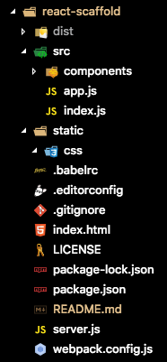

# React Scaffold
> Teke a simple scaffold for React Native.

This scaffold use [react-hot-reload](https://github.com/gaearon/react-hot-loader) to refresh page automatically

The structure is



## Development setup

OS X & Linux:

```sh
npm install
```
#### Start server
the server.js will use port:3000
```sh
npm start
```
